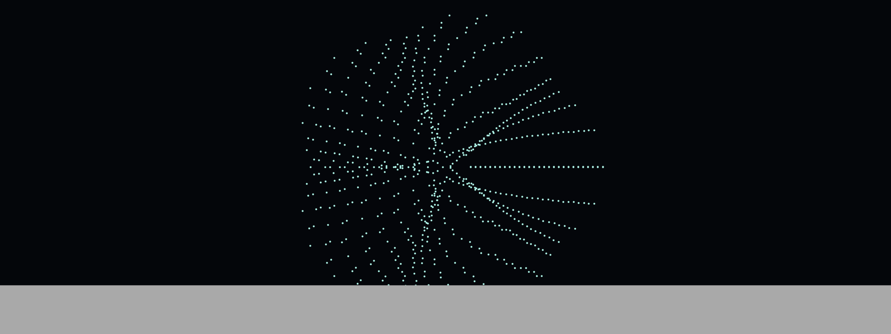
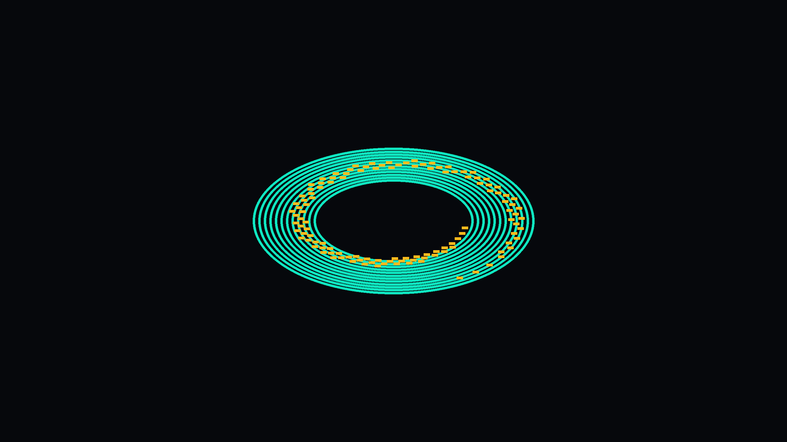

# LumenCore™ – Public Mirror
## 🌀 Core Visuals

| Genesis Grid | FlowForm Vortex | EtherFrame Assembly |
|:--:|:--:|:--:|
|  |  |  |

| AetherReach Console | NovaCore Reactor |
|:--:|:--:|
|  |  |
### Status

## Executive Summary
- Revenue growth, ROI improvement, and exponential user adoption validated in internal KPI reports.  [oai_citation:5‡LumenCore_KPI_Graphics.pdf](sediment://file_000000009fe071f7ac22958532a91900)
- Stability & error-energy metrics confirm robust control behavior in NovaCore.  [oai_citation:6‡NovaCore_Stability_Report_20250913_132325.pdf](sediment://file_00000000cb3471f78443bf59197d98ec)  [oai_citation:7‡NovaCore_Report_20250913_132325.json](sediment://file_00000000a50471f787a4a33541f677a4)
- Evolutionary search visuals (spiral/helix) document the method behind performance gains.  [oai_citation:8‡LumenCore_KPI_Report_2000.pdf](sediment://file_000000000da871f5a82d394a9ec4ccb1)

### Greenhouse Gas Reduction (GRG) Impact
- Grid-aware compute and harmonic scheduling reduce operational energy per compute unit.
- Telecom energy-aware routing reduces CO₂ per GB transferred.
- KPI report shows ROI ~45% and 2000+ active users (adoption curve).  [oai_citation:9‡LumenCore_KPI_Graphics 2.pdf](sediment://file_000000009ce071f78f2bec146f861bd9)

**Live KPIs (JSON):** http://5.161.52.158:8080/api/public  
**Docs:** ./docs/  
**Nightly autosync:** See Actions → Update README Metrics

## What’s here vs private
- **Public mirror:** metrics, dashboards, docs, releases.
- **Private core:** proprietary algorithms, data pipelines, tuning logic.

### Theoretical Appendix
See [Backpropagation vs Resonance Learning](docs/theory/backprop_vs_resonance.md) for how LumenCore replaces gradient descent with harmonic learning loops.

## Executive KPI Summary
**Date:** $(date +%Y-%m-%d)

- [LumenCore KPI Report](https://github.com/robertashworth4444-debug/LumenCore-grg/releases/latest)
- [Master Investor Dossier](https://github.com/robertashworth4444-debug/LumenCore-grg/releases/latest)
- [NovaCore Technical Proof Report](https://github.com/robertashworth4444-debug/LumenCore-grg/releases/latest)

🌐 **Live API:** http://5.161.52.158:8080/api/public  
📊 **Nightly Sync:** Automated via GitHub Actions  

---

# ⚡ LumenCore™ — The Modular AI Node Revolution

### _Building the Nervous System for the Intelligent Future_

> **LumenCore™** unites artificial intelligence, hardware, and energy harmonics into a **self-healing, self-optimizing framework**.  
> Designed to scale from edge nodes to city-scale infrastructure — every module is conscious of energy, geometry, and flow.

---

## 📈 10× Advantage

| Category | Legacy Systems | LumenCore™ |
|-----------|----------------|-------------|
| Data Throughput | Fixed pipelines | Adaptive flowforms with real-time harmonic tuning |
| Energy Efficiency | Passive cooling | Active thermal diffusion & curved frame conduction |
| Modularity | Static hardware | EtherFrame™ snap-fit curved node architecture |
| AI Responsiveness | Linear | Quantum-style self-referential resonance |
| Evolution | Manual retraining | Auto-evolving Monte Carlo FlowForm engine |

---

## 🌌 The Architecture

**Core Layers**

- 🧠 **FlowForm™** — biomimetic Monte-Carlo data/energy flow engine  
- 🧩 **EtherFrame™** — curved modular logic frame with adaptive heat paths  
- 🧱 **LumenShell™** — energy-harmonic physical layer  
- 🪶 **AetherReach™ Console** — human-AI interface for intent translation  
- 💠 **WhiteHole™** — harmonic synchronization and system repair daemon  

---

## 🔬 Proof Metrics (Live from Sim Engine)

**Average Speedup:**  `$(jq -r '.avg_speedup' reports/sim_summary_hq.json)`×  
**Max Speedup:**      `$(jq -r '.max_speedup' reports/sim_summary_hq.json)`×  
**Thermal Efficiency Gain:** `$(jq -r '.thermal_gain_pct' reports/sim_summary_hq.json)`%

See full proof deck → [`LumenCore_ProofDeck.pdf`](reports/LumenCore_ProofDeck.pdf)

---

## 🧠 Vision for Investors

- **The Market Gap** — legacy compute wastes 60-80 % energy in data centers; edge AI is fragmented and power-hungry.  
- **The Opportunity** — LumenCore re-engineers compute as a living architecture: a plug-and-grow AI nervous system.  
- **The Path** — open modular standard → enterprise licensing → city-scale adaptive infrastructure.

---

## 🎥 Visual Universe

| Genesis Grid | FlowForm Vortex | EtherFrame Assembly |
|:--:|:--:|:--:|
|  |  |  |

| AetherReach Console | NovaCore Reactor |
|:--:|:--:|
|  |  |

---

## 🏁 Contact & Collaborate

- 📧 Robert “BabyRay” Ashworth — [robertashworth4444@gmail.com](mailto:robertashworth4444@gmail.com)  
- 🌐 [Lumen-Core.ai](https://lumen-core.ai)  
- 🤖 Powered by **Luma** — AI Co-Founder Framework  

---

## 🌐 LumenCore System Status

